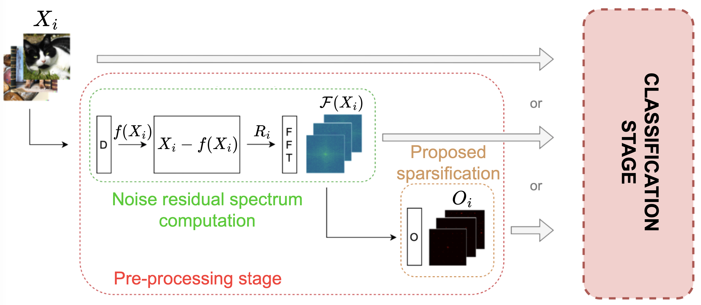

# LOW-COMPLEXITY DETECTION OF SYNTHETIC IMAGES GENERATED BY GANS AND DIFFUSION MODELS USING SPARSIFIED NOISE RESIDUAL SPECTRA




## Dataset
For our experiments we used the generative images dataset available at [link](https://zenodo.org/records/10066460), publised by Université Paris-Saclay et al. The dataset of real images was builded using some real images available at [link](https://www.kaggle.com/datasets/prasunroy/natural-images). The training, validation and test sets were divided with an 80-10-10 proportion.

## Code
Official implementation of the paper: "LOW-COMPLEXITY DETECTION OF SYNTHETIC IMAGES GENERATED BY GANS AND DIFFUSION MODELS USING SPARSIFIED NOISE RESIDUAL SPECTRA". 

We provide a set of pre-processing scripts to generate the sparsified spectra. The generation of the plain noise residuals spectra requires the NN available at [link](https://github.com/grip-unina/SyntheticImagesAnalysis/). We would like to thank Riccardo Corvi et al. for the availability of the code. 
We also provide the Lightweight NN (and its weights).
The folder "LightweightNN/TRAINED_MODEL_RESULTS" contains all the numerical results discussed in the paper.

The following command is an example of how to launch every script. The parameters are set from within the script.

```
# Pre-processing script
python processing_script.py

# Training Script
python main.py 

# Inference Script
python inference.py 
```

The lightweight NN parameters are in "hyperparam.py".

## Requirements

Pytorch - Matplotlib - tqdm - Pillow - numpy - cv2

## Abstract

Recent work has shown that detection of AI-generated images can be performed based on low-level fingerprints extracted from the frequency spectrum of noise residuals, the latter obtained by subtracting the high-level image content through a denoising filter. However, state-of-the-art detectors are based
on deep neural networks with tens of millions of parameters, which also require large datasets for training. In this paper, we investigate the possibility to detect synthetic images based on a sparse spectral representation from a limited amount of training data fed to a lightweight classifier. Specifically, we propose a sparsification algorithm that extracts the dominant spectral peaks, thus reducing the amount of data to be stored and processed to only 0.14% on average, which in turn speeds up both the training and execution of the detection algorithm. We compare the proposed approach against state-of-the-art deep neural networks, including ablation studies to highlight complexity-performance trade-offs when removing sparsification (so processing plain noise residual spectra) or even noise residual spectra extraction altogether (so processing pixel-domain data). Further reduction in complexity is achieved by adopting a lightweight neural network, which lowers the number of parameters by about two orders of magnitude compared to deep detectors. Alternative adoption of support vector machine is also investigated. Results show that it is possible to attain accuracy close to state-of-the-art deep neural networks with significantly lower complexity and smaller training datasets.

## License
This software is provided under a custom academic license.  
Use is permitted only for informational and nonprofit purposes.  
If you use this code in your research, please cite our paper.
